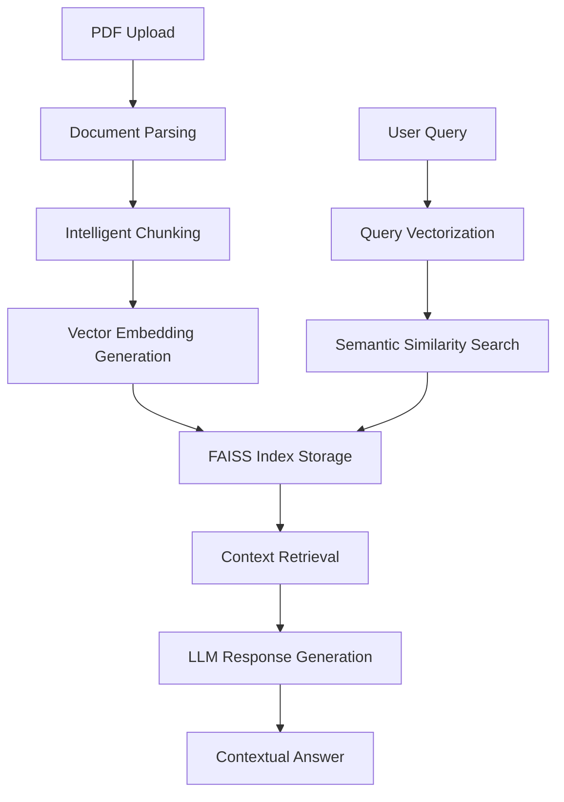

# 📚 ChatPDF
> **Intelligent Document Intelligence System** - Transform static PDFs into interactive conversational experiences

ChatPDF is an **AI-powered document analysis platform** that leverages advanced **Natural Language Processing (NLP)** and **Retrieval-Augmented Generation (RAG)** architecture to enable seamless human-document interaction. Upload any PDF and engage in contextual conversations through sophisticated **semantic search** and **neural language understanding**.

Transform dense documentation into accessible knowledge through cutting-edge **vector embeddings** and **large language model** integration—revolutionizing how you consume and interact with textual content.

---

## 🔥 **Production Use Cases**

| Vertical | Application | Impact |
|----------|-------------|---------|
| 🎓 **Academia** | Query textbooks, research papers, thesis documents | **90% faster** comprehension |
| 🔬 **Research & Development** | Extract insights from scientific publications, whitepapers | **Zero manual scanning** |
| 💼 **Enterprise** | Analyze contracts, compliance documents, technical specs | **Instant knowledge retrieval** |
| 📊 **Business Intelligence** | Parse financial reports, market research, analytics | **Real-time data extraction** |
| 🌐 **General Productivity** | Navigate manuals, guides, documentation | **Effortless information access** |

---

## 🚀 **Core Architecture & Features**

### ⚡ **Intelligent Processing Pipeline**
- ✅ **Multi-format PDF ingestion** with unlimited payload capacity
- 💬 **Natural Language Query Interface** - conversational AI interaction
- 🤖 **Hybrid AI Engine**: LLM + Vector Embeddings + FAISS indexing
- 🔍 **Semantic chunking** with contextual boundary detection  
- 🧠 **Memory-optimized architecture** with horizontal scalability
- 🎯 **Robust error handling** and comprehensive user feedback systems

### 🏗️ **Technical Implementation**
- **Transformer-based embeddings** for semantic understanding
- **Vector similarity search** through FAISS approximate nearest neighbor
- **Document segmentation** with intelligent content preservation
- **Context-aware response generation** via fine-tuned language models

---

## 🧠 **System Architecture Flow**



**Pipeline Breakdown:**
1. **Document Ingestion** → Multi-threaded PDF parsing and text extraction
2. **Content Segmentation** → Semantic chunking with overlap optimization  
3. **Neural Encoding** → High-dimensional vector representation via transformer models
4. **Vector Indexing** → FAISS approximate nearest neighbor storage
5. **Query Processing** → Real-time semantic search and context retrieval
6. **Response Synthesis** → LLM-powered contextual answer generation

---

## 🛠️ **Technology Stack**

| **Layer** | **Technology** | **Purpose** |
|-----------|----------------|-------------|
| 🧠 **ML/AI** | HuggingFace Transformers + LangChain | Neural embeddings & LLM orchestration |
| 🔎 **Vector Engine** | FAISS (Facebook AI Similarity Search) | High-performance similarity indexing |
| 📄 **Document Processing** | PyPDF2 + Custom parsers | PDF parsing & text extraction |
| 🌐 **Frontend** | Streamlit | Interactive web application |
| 💬 **AI Framework** | LangChain | LLM integration & prompt engineering |
| 🐍 **Runtime** | Python 3.10+ | Core application logic |

---

## ⚙️ **Project Architecture**

```
ChatPDF/
├── 🎯 app.py                    # Streamlit application entry point
├── 📄 pdf_reader.py            # Document parsing & segmentation engine  
├── 🔍 vectorstore.py           # FAISS vector database management
├── 📦 requirements.txt         # Dependency specification
└── 🚫 .gitignore              # Version control exclusions
```

---

## 💻 **Local Development Setup**

### **Prerequisites**
- Python 3.10+ runtime environment
- Virtual environment management
- Git version control

### **Installation Pipeline**

```bash
# 1. Repository cloning
git clone https://github.com/Trevisx07/ChatPDF.git
cd ChatPDF

# 2. Virtual environment initialization  
python -m venv venv
# Windows activation
venv\Scripts\activate
# Unix/MacOS activation  
source venv/bin/activate

# 3. Dependency installation
pip install -r requirements.txt

# 4. Application deployment
streamlit run app.py
```

**Access Point:** `http://localhost:8501`

---

## 📁 **Workflow Demonstration**

```python
# Example interaction flow
1. PDF_UPLOAD → "research_paper.pdf" 
2. QUERY → "What are the key findings and statistical significance?"
3. PROCESSING → Semantic search + context extraction
4. RESPONSE → AI-generated summary with source citations
```

---

## 🧱 **Core Dependencies**

```txt
streamlit              # Web application framework
langchain             # LLM orchestration & RAG pipeline  
faiss-cpu            # Vector similarity search engine
huggingface-hub      # Transformer model integration
pypdf2               # PDF parsing & text extraction
python-dotenv        # Environment configuration
```

**Installation:** `pip install -r requirements.txt`

---

## 🧪 **Roadmap & Future Enhancements**

### **Phase 1: Infrastructure**
- 🔐 **OAuth authentication** & user session management
- ☁️ **Cloud storage integration** (AWS S3, Azure Blob)
- 📊 **Analytics dashboard** with usage metrics

### **Phase 2: Intelligence**  
- 🗣️ **Speech-to-text integration** & TTS response synthesis
- 📱 **Progressive Web App** for mobile optimization
- 🌍 **Multi-language support** with cross-lingual embeddings

### **Phase 3: Advanced Features**
- 🤖 **Custom model fine-tuning** for domain specialization
- 📈 **Data visualization** from extracted insights
- 🔗 **API gateway** for third-party integrations

---

## 🤝 **Contributing Guidelines**

```bash
# Development workflow
1. Fork repository → Create feature branch
2. git checkout -b feature/enhancement-name
3. Implement changes → Add comprehensive tests  
4. git commit -m "feat: add enhancement description"
5. Push changes → Submit pull request
```

**Standards:** Follow PEP 8, add docstrings, maintain test coverage >85%

---

## 🛡️ **License & Attribution**

**MIT License** - Open source with commercial usage rights

---

## 🙌 **Credits & Acknowledgments**

**🔬 Engineered by:** [Het Patel](https://github.com/Trevisx07)  
**⚡ Powered by:** OpenAI GPT • LangChain • FAISS • HuggingFace Transformers  
**🌟 Repository:** [`github.com/Trevisx07/ChatPDF`](https://github.com/Trevisx07/ChatPDF)

---

<div align="center">

**⭐ Star this repository if you find it valuable!**  
*Built with ❤️ for the developer community*

</div>
